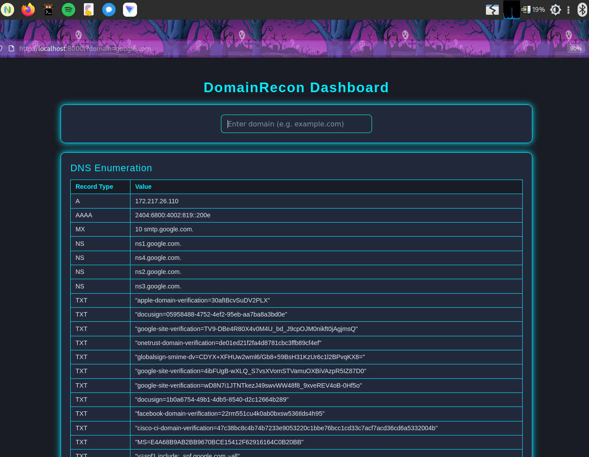
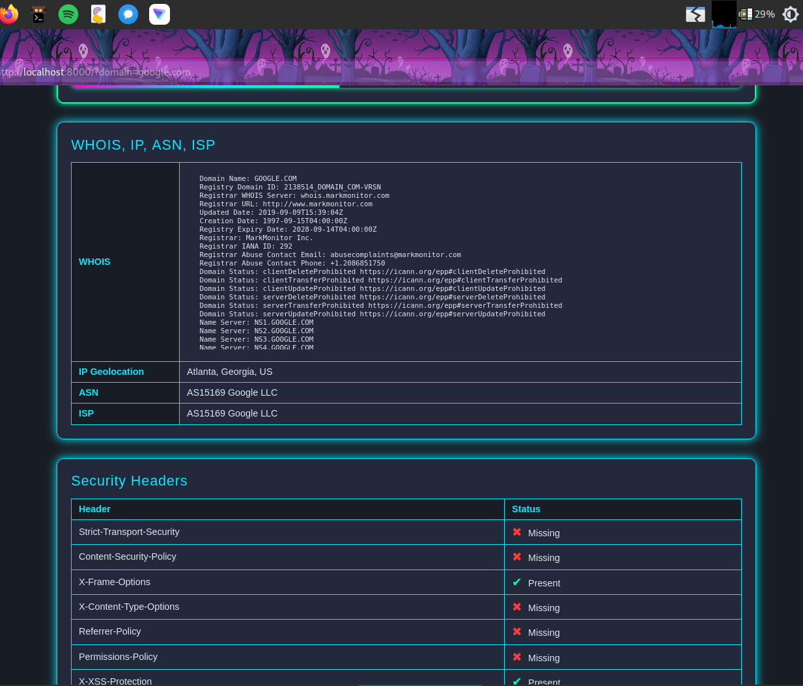

# Django Recon

This project is a Django-based web application.

---

**This project is a 3rd Semester project for BPPIMT, Salt Lake.**

---

## Project Structure

```
db.sqlite3
LICENSE
manage.py
README.md
requirements.txt
core/
  __init__.py
  admin.py
  apps.py
  models.py
  tests.py
  views.py
  migrations/
    __init__.py
django_recon/
  __init__.py
  asgi.py
  settings.py
  urls.py
  wsgi.py
myenv/
  ... (virtual environment files)
static/
  css/
    style.css
  img/
  js/
    main.js
templates/
  base.html
  home.html
```

## Demo

### Demo





*Demo images are shown above.*

## Prerequisites
- Python 3.11+
- pip (Python package manager)
- (Recommended) Virtual environment tool: `venv`

## Setup Instructions


### 1. Clone the Repository

```sh
git clone https://github.com/DebaA17/django-recon.git
cd django-recon
```


### 2. Create and Activate Virtual Environment


#### On Linux/Mac:
```sh
python3 -m venv myenv
source myenv/bin/activate
```


#### On Windows:
```sh
python -m venv myenv
myenv\Scripts\activate
```


### 3. Install Dependencies
```sh
pip install -r requirements.txt
```


### 4. Apply Migrations
```sh
python manage.py migrate
```


### 5. Create a Superuser (Optional, for admin access)
```sh
python manage.py createsuperuser
```


### 6. Run the Development Server

#### On Linux/Mac:
```sh
python manage.py runserver 0.0.0.0:8000
```

#### On Windows:
```sh
python manage.py runserver
```


The server will start at http://127.0.0.1:8000/


## Additional Commands

- **Collect static files:**
  ```sh
  python manage.py collectstatic
  ```
- **Run tests:**
  ```sh
  python manage.py test
  ```


## Notes
- Always activate your virtual environment before running any Django commands.
- For production deployment, additional configuration is required (see Django documentation).

## License

This project is licensed under the MIT License. See the [LICENSE](LICENSE) file for details.
